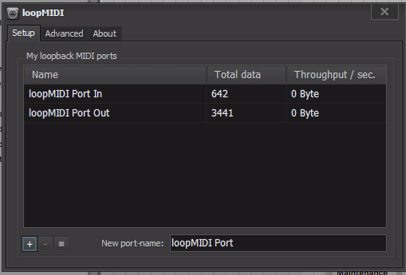
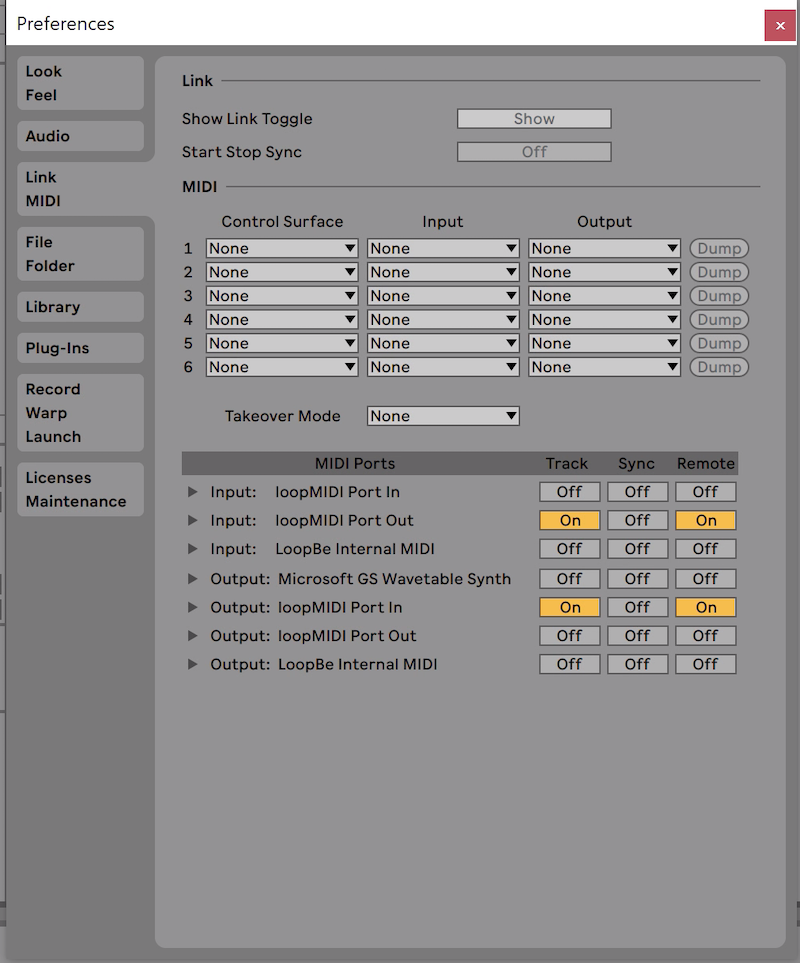

# Network MIDI Hub

## Description
A client/server interface to connect multiple clients to a centralized MIDI server. 


All the MIDI messages received on the client, will be forwared to the server and that will be retransmitted to all the connected clients minus the sender. Locally the client spawn a virtual midi device to allow easy connection with any compatible midi app (DAW, Pd, Max, Supercollider, ...)


## Usage

TLDR;

If you want to kickstart and run it, just download the binaries and execute them

### Binaries

On the _dist_ folder you have the binaries for Mac (Mojave or higher) and Windows.

Check instructions for the Windows Client, as it needs extra care.

### Client

#### Non binaries - OSX
Install pipenv and pyenv on your system (mac instructions assuming brew installed):

```
brew install pyenv pipenv
```

run a sync:

```
pipenv sync
```

When you have an environment with pipenv you can run it by:

```
pipenv run python client.py
```

#### Windows Client
Is not supported to spawn Virtual Midi ports on Windows without the use of third party application. I've found a workaround using [loopMidi](http://www.tobias-erichsen.de/software/loopmidi.html).

Once installed, open loopMidi and remove any existing ports, then add the ports as shown on this image:



And then setup your DAW/Audio MIDI ports as similar to this:



Don't be fooled by inputs and output _dislexia_, If doesn't work at the first time, just switch to the oposite on you application.

The client "autoguess" if it's ran on Windows OS, to switch to this specific configuration.

Check the 'Development instructions' below if you prefer to not run the binaries and use python to setup your environment accordingly.


### Server

By default it runs on the port 8141 and listen to 0.0.0.0

The server it can also be run on docker

```
docker build -t network-midi-hub-server .
docker run -p8141:8141 --rm network-midi-hub-server

```

## Development

### TODO

- For now is based in TCP sockets, probably will be more performant in latency using UDP.
- Still BrokenPipe after massive amounts of midi messages
- Binary for Raspberry Pi
- Better Windows Support: midi ports spawn on windows don't work

```
			PS C:\Users\User\git\network-midi-hub\dist> .\client.exe
Host to connect [127.0.0.1]: 
Traceback (most recent call last):
  File "client.py", line 174, in <module>
  File "client.py", line 133, in main
  File "mido\backends\backend.py", line 91, in open_input
  File "mido\ports.py", line 161, in __init__
  File "mido\ports.py", line 86, in __init__
  File "mido\backends\rtmidi.py", line 124, in _open
  File "mido\backends\rtmidi.py", line 80, in _open_port
  File "src\_rtmidi.pyx", line 642, in rtmidi._rtmidi.MidiBase.open_virtual_port
NotImplementedError: Virtual ports are not supported by the Windows MultiMedia API.
[12736] Failed to execute script client
```

### Pipenv

The requirements are created using pipenv. In order to use the same environment you can run:

```
pipenv sync && pipenv shell
```

To update the requirements you can modify the Pipfile and run

```
docker run --rm \
-v `pwd`:/workspace \
-e PIPENV_PIPFILE=Pipfile \
3amigos/pipenv-all bash -c \
"pipenv lock -r > requirements.txt && pipenv lock -r --dev > requirements-dev.txt"
```

### pyinstaller

#### OSX (and presumable Linux):

Setup a Python that has CPython shared-library enabled:

```
env PYTHON_CONFIGURE_OPTS="--enable-shared" pyenv install 3.8.6
```

go inside the the environment:
```
pipenv sync && pipenv shell
```

create an executable of the client:
```
pyinstaller -F --noconfirm --hiddenimport mido.backends.rtmidi client.py
```

#### Windows 10

Install pyenv-win and pipenv
Setup a Python that has CPython shared-library enabled:
```
set PYTHON_CONFIGURE_OPTS '--enable-shared'
pyenv install 3.8.6
```

go inside the environment, install modules:
```
py -m pipenv --python /Users/Shadow/.pyenv/pyenv-win/versions/3.8.6/python3.exe sync
py -m pipenv --python /Users/Shadow/.pyenv/pyenv-win/versions/3.8.6/python3.exe shell
pip install -r .\requirements-dev.txt
```

To create the Windows executable is the same command

```
pyinstaller -F --noconfirm --hiddenimport mido.backends.rtmidi client.py
```
